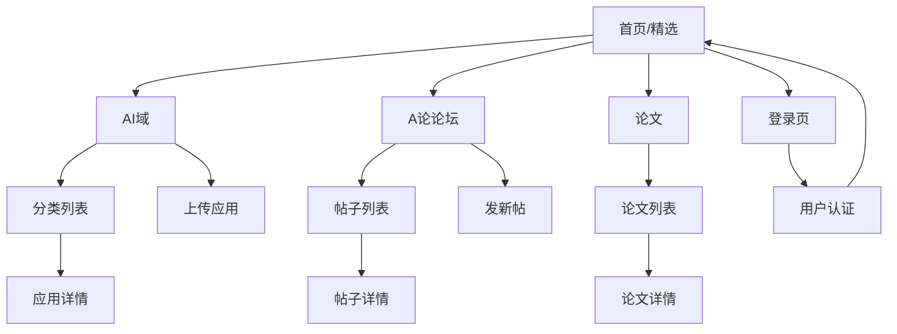

# AI超市产品需求文档

## 1. Product Overview
AI超市是一个集AI应用展示、分享、讨论和学术论文浏览于一体的综合性平台。用户可以浏览精选AI应用、按分类查找工具、参与社区讨论、上传分享自己的AI应用，以及获取最新的AI学术论文资讯。

平台旨在为AI开发者、研究者和爱好者提供一个集中的资源分享和交流平台，促进AI技术的传播和应用。

## 2. Core Features

### 2.1 User Roles
| Role | Registration Method | Core Permissions |
|------|---------------------|------------------|
| 游客用户 | 无需注册 | 可浏览所有内容，查看应用详情、帖子、论文 |
| 注册用户 | 邮箱注册 | 可发布帖子、评论、点赞、收藏、上传AI应用 |

### 2.2 Feature Module
我们的AI超市包含以下主要页面：
1. **精选页面**：推荐AI应用展示、搜索筛选、热门排行
2. **AI域页面**：分类浏览、应用列表、上传功能
3. **A论论坛页面**：帖子列表、发帖、帖子详情、评论系统
4. **论文页面**：论文列表、详情展示、数据可视化
5. **登录页面**：用户认证、权限管理

### 2.3 Page Details
| Page Name | Module Name | Feature description |
|-----------|-------------|---------------------|
| 精选页面 | 推荐展示区 | 展示平台推荐的AI应用卡片，包含应用图标、名称、描述 |
| 精选页面 | 搜索筛选 | 支持按关键词或标签搜索和筛选AI应用 |
| 精选页面 | 应用详情 | 点击卡片查看应用详细信息，包含版本、开发者、下载链接 |
| 精选页面 | 互动功能 | 支持点赞、收藏应用，展示热门排行和轮播推荐 |
| AI域页面 | 分类导航 | 按类别展示AI应用（机器学习、图像处理、自然语言等） |
| AI域页面 | 应用浏览 | 分类下的应用列表展示，支持搜索和筛选 |
| AI域页面 | 上传功能 | 用户可上传新AI应用，填写名称、描述、分类、图标等信息 |
| AI域页面 | 评价系统 | 用户可对应用进行评价和评论 |
| A论论坛页面 | 帖子列表 | 显示帖子标题、作者、摘要、回复数、点赞数，支持分页 |
| A论论坛页面 | 搜索功能 | 支持按帖子标题关键词搜索 |
| A论论坛页面 | 发帖功能 | 登录用户可发布帖子，支持富文本内容和附件上传 |
| A论论坛页面 | 帖子详情 | 显示完整帖子内容、评论列表，支持多层回复 |
| A论论坛页面 | 互动功能 | 支持对帖子和评论进行点赞、回复 |
| 论文页面 | 论文列表 | 展示AI相关论文摘要，包含标题、作者、年份、来源 |
| 论文页面 | 搜索筛选 | 支持按关键词或分类搜索论文 |
| 论文页面 | 论文详情 | 显示论文摘要、关键字、PDF下载链接 |
| 论文页面 | 数据可视化 | 展示统计图表，如年度发表数量、领域分布等 |
| 登录页面 | 用户认证 | 用户登录验证，支持邮箱登录 |
| 登录页面 | 权限管理 | 控制用户访问权限，区分游客和注册用户功能 |

## 3. Core Process

**游客用户流程：**
用户可以直接访问平台浏览所有内容，包括精选应用、AI域分类、论坛帖子和学术论文。当尝试进行需要登录的操作（如点赞、评论、上传）时，系统会引导用户前往登录页面。

**注册用户流程：**
用户登录后可以进行所有交互操作，包括发布帖子、评论回复、点赞收藏、上传AI应用等。用户可以在个人中心管理自己发布的内容。

## 4. User Interface Design

### 4.1 Design Style
- **主色调**：科技蓝 (#1890FF) 和深灰 (#2F3349)
- **辅助色**：浅灰 (#F5F5F5) 和白色 (#FFFFFF)
- **按钮样式**：圆角按钮，支持悬停效果
- **字体**：系统默认字体，标题使用 16-24px，正文使用 14px
- **布局风格**：卡片式布局，顶部导航栏固定
- **图标风格**：使用 Element Plus 图标库，简洁现代

### 4.2 Page Design Overview
| Page Name | Module Name | UI Elements |
|-----------|-------------|-------------|
| 精选页面 | 推荐展示区 | 网格布局的应用卡片，每卡片包含图标、标题、描述和操作按钮 |
| 精选页面 | 搜索筛选 | 顶部搜索栏，标签筛选器，排序选择器 |
| AI域页面 | 分类导航 | 左侧分类菜单或顶部标签页，高亮当前选中分类 |
| AI域页面 | 上传功能 | 表单布局，包含文件上传区域和输入字段 |
| A论论坛页面 | 帖子列表 | 列表式布局，每项显示标题、作者、时间、统计信息 |
| A论论坛页面 | 帖子详情 | 单栏布局，富文本内容展示，底部评论区 |
| 论文页面 | 数据可视化 | 图表区域使用阿里图表库，响应式图表展示 |
| 登录页面 | 用户认证 | 居中表单布局，简洁的输入框和按钮设计 |

### 4.3 Responsiveness
平台采用桌面优先的响应式设计，使用 TailwindCSS 的响应式类确保在移动设备上的良好体验。主要断点为 768px（平板）和 1024px（桌面），支持触摸交互优化。