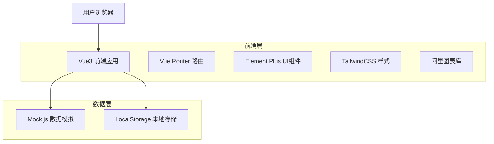
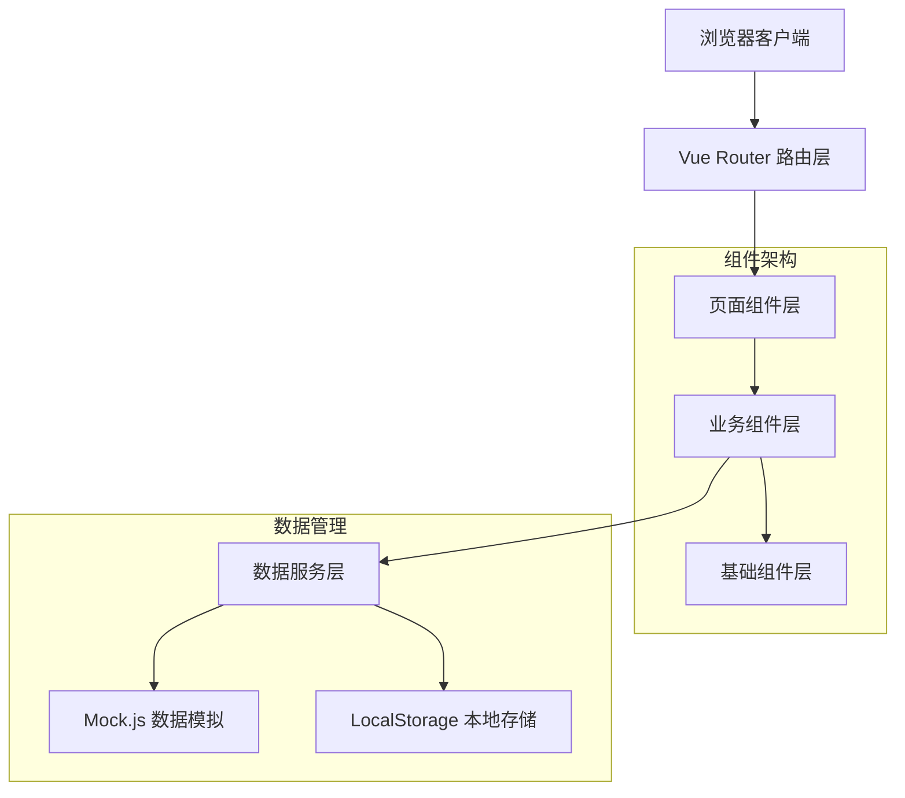
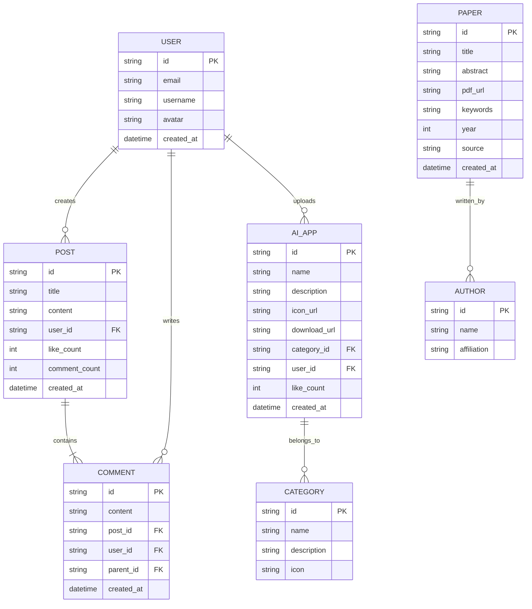

# AI超市技术架构文档

## 1. Architecture design



## 2. Technology Description

- Frontend: Vue@3 + Vue Router@4 + Element Plus@2 + TailwindCSS@3 + Vite@4
- Mock Data: Mock.js@1.1
- Charts: 阿里图表库 (AntV/G2)
- Storage: LocalStorage (用户状态管理)

## 3. Route definitions

| Route | Purpose |
|-------|---------|
| / | 主布局页面，默认重定向到精选页面 |
| /featured | 精选页面，展示推荐AI应用列表 |
| /aidomain | AI域主页面，显示AI应用分类列表 |
| /aidomain/upload | 上传新AI应用页面，需要登录权限 |
| /aidomain/category/:id | 指定分类下的AI应用列表页面 |
| /forum | A论论坛首页，显示帖子列表 |
| /forum/new | 发新帖页面，需要登录权限 |
| /forum/post/:id | 帖子详情页面，包含评论功能 |
| /papers | 论文列表页面，展示AI相关论文 |
| /papers/:id | 论文详情页面，显示论文完整信息 |
| /login | 用户登录页面 |

## 4. API definitions (模拟数据接口)

### 4.1 Core API

用户认证相关
```
POST /api/auth/login
```

Request:
| Param Name| Param Type  | isRequired  | Description |
|-----------|-------------|-------------|-------------|
| email     | string      | true        | 用户邮箱 |
| password  | string      | true        | 用户密码 |

Response:
| Param Name| Param Type  | Description |
|-----------|-------------|-------------|
| success   | boolean     | 登录是否成功 |
| token     | string      | 用户令牌 |
| user      | object      | 用户信息 |

Example
```json
{
  "email": "user@example.com",
  "password": "123456"
}
```

AI应用相关
```
GET /api/apps/featured
GET /api/apps/category/:id
POST /api/apps/upload
POST /api/apps/:id/like
```

论坛相关
```
GET /api/forum/posts
GET /api/forum/post/:id
POST /api/forum/posts
POST /api/forum/post/:id/comments
```

论文相关
```
GET /api/papers
GET /api/papers/:id
GET /api/papers/stats
```

## 5. Server architecture diagram (前端架构)



## 6. Data model

### 6.1 Data model definition



### 6.2 Data Definition Language

由于使用 Mock.js 进行数据模拟，以下为模拟数据结构定义：

用户数据 (User)
```javascript
// Mock 用户数据结构
const userMock = {
  id: '@guid',
  email: '@email',
  username: '@cname',
  avatar: '@image("100x100")',
  created_at: '@datetime'
}

// 初始化用户数据
const users = Mock.mock({
  'list|10-20': [userMock]
})
```

AI应用数据 (AI_APP)
```javascript
// Mock AI应用数据结构
const aiAppMock = {
  id: '@guid',
  name: '@ctitle(5, 10)',
  description: '@cparagraph(2, 4)',
  icon_url: '@image("200x200")',
  download_url: '@url',
  category_id: '@pick(["ml", "cv", "nlp", "audio", "robotics"])',
  user_id: '@guid',
  like_count: '@integer(0, 1000)',
  created_at: '@datetime'
}

// 分类数据
const categories = [
  { id: 'ml', name: '机器学习', description: '机器学习相关应用', icon: 'cpu' },
  { id: 'cv', name: '计算机视觉', description: '图像处理和计算机视觉', icon: 'camera' },
  { id: 'nlp', name: '自然语言处理', description: '文本处理和语言理解', icon: 'message' },
  { id: 'audio', name: '音频处理', description: '语音识别和音频分析', icon: 'microphone' },
  { id: 'robotics', name: '机器人技术', description: '机器人控制和自动化', icon: 'robot' }
]
```

论坛帖子数据 (POST)
```javascript
// Mock 帖子数据结构
const postMock = {
  id: '@guid',
  title: '@ctitle(10, 20)',
  content: '@cparagraph(5, 10)',
  user_id: '@guid',
  like_count: '@integer(0, 500)',
  comment_count: '@integer(0, 100)',
  created_at: '@datetime'
}

// Mock 评论数据结构
const commentMock = {
  id: '@guid',
  content: '@cparagraph(1, 3)',
  post_id: '@guid',
  user_id: '@guid',
  parent_id: '@pick([null, "@guid"])',
  created_at: '@datetime'
}
```

论文数据 (PAPER)
```javascript
// Mock 论文数据结构
const paperMock = {
  id: '@guid',
  title: '@ctitle(15, 30)',
  abstract: '@cparagraph(3, 5)',
  pdf_url: '@url',
  keywords: '@pick(["深度学习", "神经网络", "计算机视觉", "自然语言处理", "强化学习"])',
  year: '@integer(2020, 2024)',
  source: '@pick(["NIPS", "ICML", "ICLR", "CVPR", "ACL"])',
  authors: '@cname, @cname, @cname',
  created_at: '@datetime'
}
```